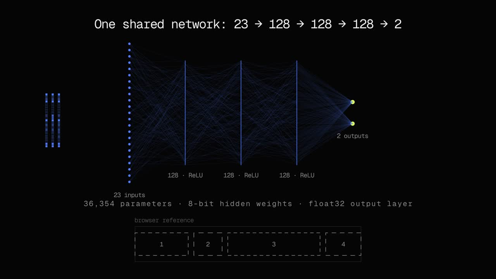

# neural-flexbox

[](https://github.com/aaronvanston/neural-flexbox/raw/refs/heads/main/docs/flex-explainer.mp4)

[Watch / download the explainer](https://github.com/aaronvanston/neural-flexbox/raw/refs/heads/main/docs/flex-explainer.mp4): from CSS layout rules to 23 input features, through the shared network, and back to predicted positions and widths.

A small learned approximation of a single CSS flex row. The website lets you manipulate a layout and compare predicted boxes with Chromium's actual layout. All inference stays local.

The accepted `refined-v1` model has **36,354 parameters**, **33.0 KiB Brotli-compressed weights**, and **0.350 px mean coordinate error** on 5,000 held-out generated layouts. That mean is not a bound: p95 is 1.084 px and the largest test error is 13.96 px. See [MODEL_CARD.md](MODEL_CARD.md) for scope and evaluation.

This is a demo and a reproducible experiment. No npm publication is needed. Clone the source to run the playground, inspect the weights, or generate training data.

## Run the website

Node.js 22+ and npm are required.

```sh
git clone https://github.com/aaronvanston/neural-flexbox.git
cd neural-flexbox
npm ci
npm run dev
```

Open http://localhost:4174. The playground supports resizing, per-box basis/grow/shrink editing, six justify modes, insertion/removal, gap inspection and keyboard controls.

## Try the model locally

```js
import { createLayoutPredictor } from "./packages/core/src/index.js";

const predict = await createLayoutPredictor();
const boxes = predict({
  width: 760,
  gap: 16,
  justify: "space-between",
  items: [
    { basis: 120, grow: 1, shrink: 1 },
    { basis: 200, grow: 2, shrink: 1 },
  ],
});
console.log(boxes); // positions and widths in pixels
```

Run the included example directly with Node.js; no dependency install or build is needed:

```sh
node examples/layout.mjs
```

Actual output from the included model, rounded to three decimal places:

```json
[
  {
    "x": 0.012,
    "width": 261.302
  },
  {
    "x": 277.216,
    "width": 482.627
  }
]
```

CSS places these boxes at x = 0 and 277.333 px, with widths of 261.333 and 482.667 px. GitHub displays this recorded output; it does not execute the snippet.

Load once and reuse the synchronous predictor. The workspace package works in Node.js and browser ES modules; its weights are resolved relative to the module. TypeScript declarations are included. Bundlers must preserve the model asset or callers can pass its bytes as `{ weights: ArrayBuffer }`. Input validation checks item rules and rejects invalid numerical inputs; the training range is not an API limit. Widths above 1,200 px are accepted for extrapolation experiments, not guaranteed to match training accuracy.

## Repository

| Directory            | Contents                                                                                 |
| -------------------- | ---------------------------------------------------------------------------------------- |
| `packages/core`      | Dependency-free inference API, types and exact accepted packed weights                   |
| `packages/training`  | Browser data generators, PyTorch training, packaging, evaluation and accepted provenance |
| `packages/benchmark` | Package size and real-browser parity/interaction harnesses                               |
| `apps/website`       | Static website and interactive playground                                                |

Generated datasets, training runs, caches and screenshots are ignored. The accepted weights, dequantized continuation export, dataset manifests and parity fixtures are included. There are no downloaded source corpora or earlier experimental checkpoints.

## Optional local checks and static build

```sh
npm test
npm run benchmark
npx playwright install chromium
# With npm run dev running:
npm run verify
npm run build
```

There are no automatic GitHub Actions workflows. Run these checks locally when needed.

`verify` checks decoded browser predictions against 100 PyTorch fixtures and exercises controls/mobile layout. The full accepted evaluation is recorded under `packages/training/active`; fresh full evaluation can be generated using the training tools. `build` writes a standalone static site to `dist/`. The included server honors Brotli/gzip sidecars. A different static host must configure the appropriate `Content-Encoding` headers to get the compressed size; serving the raw 39,840-byte model still works. No deployment is performed.

## Training

See [the training guide](packages/training/README.md) for environment setup, data generation, the successful training recipe, continuation, and evaluation. The included checkpoint is the measured reference; regeneration may differ across PyTorch, GPU and Chromium versions.

## Inspiration

[GPU Lexer](https://github.com/vercel-labs/gpu-lexer) inspired the teacher-generated data, inspectable model and browser verification approach. neural-flexbox uses its own layout data and a dense CPU inference model; it does not claim their architecture or GPU speedups.

The playground allows gaps and viewport widths beyond the training range. The predictor accepts positive finite widths and nonnegative finite gaps; these inputs are experiments, not an extension of the measured accuracy claims.

To reuse the runtime elsewhere, copy `packages/core` intact and import its `src/index.js`; keep the adjacent `model` directory so it can find the weights. Sharing source on GitHub, hosting the demo, and publishing to npm are separate choices. None requires the other.

The live snippet uses [GPU Lexer](https://github.com/vercel-labs/gpu-lexer) 0.0.2 for syntax highlighting. Its runtime is copied from the pinned npm dependency into the website assets during install/build; it is separate from the 33 KiB flexbox model. WebGPU needs a supported browser and a secure context (HTTPS or localhost). There is no alternate highlighter; unsupported browsers show plain text.

## License

MIT © Aaron Vanston, covering this project’s source and included model weights. See [LICENSE](LICENSE) and [third-party notices](THIRD_PARTY_NOTICES.md).
